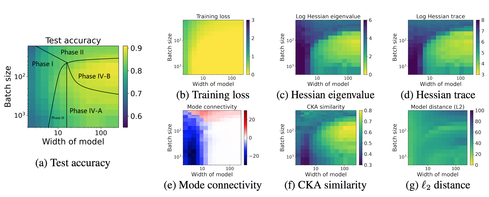

# Taxonomizing local versus global structure in neural network loss landscapes

## Introduction

This repository includes the programs to reproduce the results of the paper "Taxonomizing local versus global structure in neural network loss landscapes". The code has been tested on Python 3.8.12 with PyTorch 1.10.1 and CUDA 10.2.


(**Caricature of different types of loss landscapes**). Globally well-connected versus globally poorly-connected loss landscapes; and locally sharp versus locally flat loss landscapes. Globally well-connected loss landscapes can be interpreted in terms of a global “rugged convexity”; and globally well-connected and locally flat loss landscapes can be further divided into two sub-cases, based on the similarity of trained models.


(**2D phase plot**). Partitioning the 2D load-like—temperature-like diagram into
different phases of learning, varying batch size to change temperature and varying model width to change load. Models are trained with ResNet18 on CIFAR-10. All plots are on the same set of axes.

## Usage

First, follow the steps below to install the necessary packages.
```
conda create -n loss_landscape python=3.8
conda activate loss_landscape
conda install pytorch torchvision cudatoolkit=10.2 -c pytorch
pip install -r requirements.txt
```

#### Training

Then, use the following command to generate the training scripts.
```
cd workspace/src
python example_experiment.py --metrics train
```
The training script can be found in the folder `bash_scripts/width_lr_decay`.

We recommend using some job scheduler to execute the training script. For example, use the following to generate an example slurm script for training.
```
python example_experiment.py --metrics train --generate-slurm-scripts
```

#### Evaluating metrics and generating phase plots

Use the following command to generate the scripts for different generalization metrics.
```
python example_experiment.py --metrics curve CKA hessian dist loss_acc
```

You can use our prior results, which are compressed and stored in `workspace/checkpoint/results.tar.gz`. Please decompress them using the command below.
```
cd workspace/checkpoint/
tar -czvf results.tar.gz
```

After the generalization metrics are obtained, use the jupyter notebook `Load_temperature_plots.ipynb` in `workspace/src/visualization/` to visualize the results. 


## Citation

We appreciate it if you would please cite the following paper if you found the repository useful for your work:

```
@inproceedings{yang2021taxonomizing,
  title={Taxonomizing local versus global structure in neural network loss landscapes},
  author={Yang, Yaoqing and Hodgkinson, Liam and Theisen, Ryan and Zou, Joe and Gonzalez, Joseph E and Ramchandran, Kannan and Mahoney, Michael W},
  booktitle={Thirty-Fifth Conference on Neural Information Processing Systems},
  year={2021}
}
```

License
----

MIT