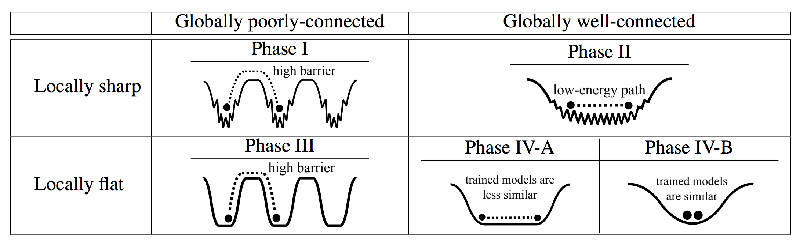

# Taxonomizing local versus global structure in neural network loss landscapes

## Introduction

This repository includes the programs to reproduce the results of the paper "Taxonomizing local versus global structure in neural network loss landscapes". The code has been tested on Python 3.8.12 with PyTorch 1.10.1 and CUDA 10.2.


(**Caricature of different types of loss landscapes**). Globally well-connected versus globally poorly-connected loss landscapes; and locally sharp versus locally flat loss landscapes. Globally well-connected loss landscapes can be interpreted in terms of a global “rugged convexity”; and globally well-connected and locally flat loss landscapes can be further divided into two sub-cases, based on the similarity of trained models.

## Citation
We appreciate it if you would please cite the following paper if you found the repository useful for your work:

```
@inproceedings{yang2021taxonomizing,
  title={Taxonomizing local versus global structure in neural network loss landscapes},
  author={Yang, Yaoqing and Hodgkinson, Liam and Theisen, Ryan and Zou, Joe and Gonzalez, Joseph E and Ramchandran, Kannan and Mahoney, Michael W},
  booktitle={Thirty-Fifth Conference on Neural Information Processing Systems},
  year={2021}
}
```

License
----

MIT